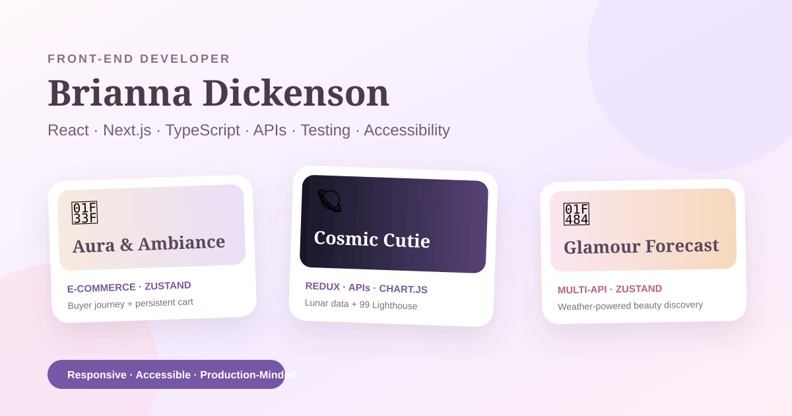
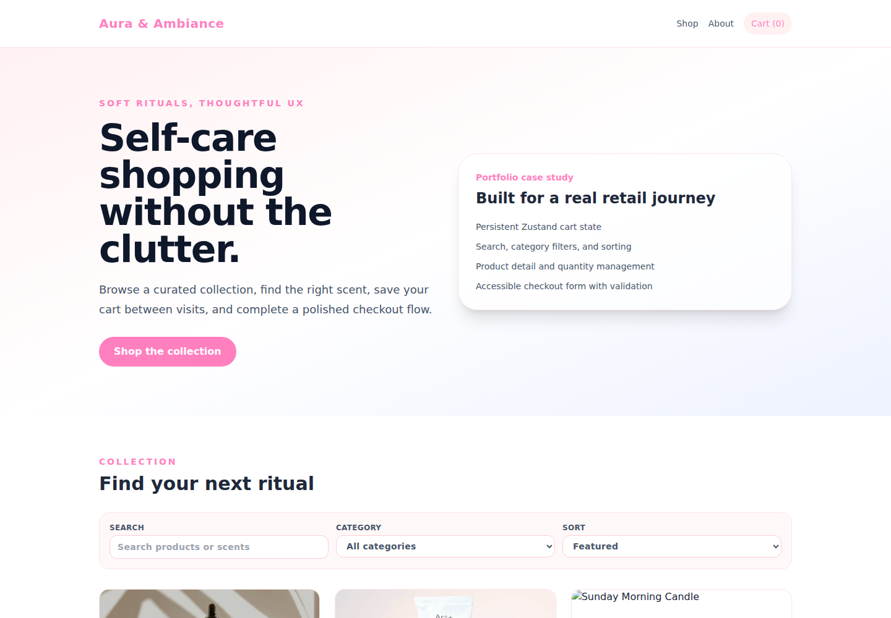
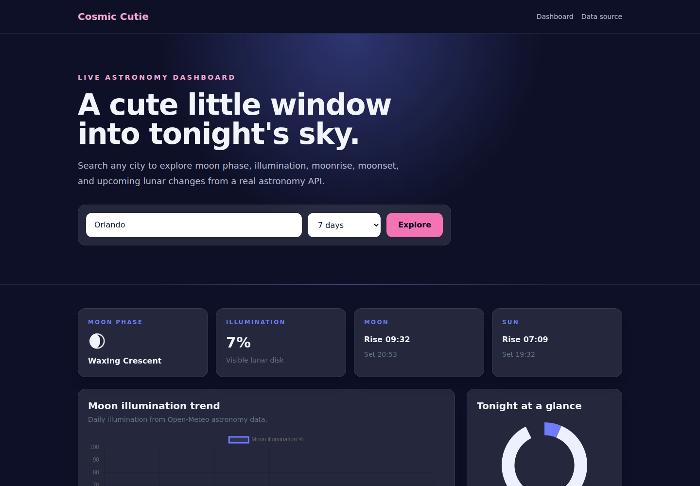
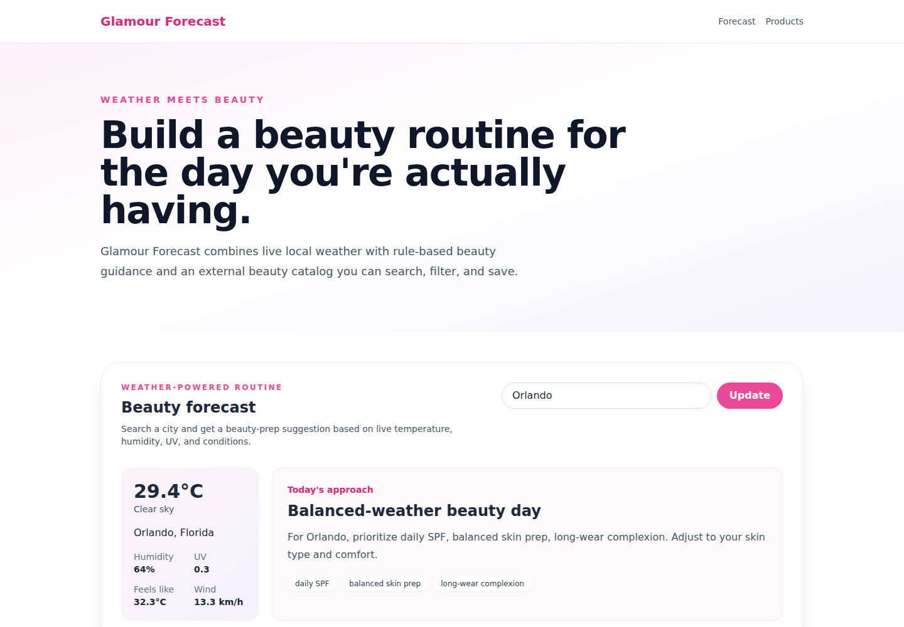

# 🎀 Brianna Dickenson 🎀

## **Front-End Developer | React · Next.js · TypeScript**

I build responsive, accessible front-end experiences with polished UI, clear state management, API-driven features, testing, and measurable production quality.



---

## 💌 Work With Me

🕓 **Seeking Full Time Remote Position**  [](https://www.linkedin.com/in/brianna-dickenson-9555515b)

💌 **Available For Freelance** [](mailto:breyhanadickenson@gmail.com?subject=Interested%20in%20Working%20With%20You)

🌐 **[View Live Portfolio](https://front-end-developer-github-portfolio.vercel.app)**

---

## 🧠 Core Stack

**Languages & Web:** HTML5 · CSS3 · JavaScript · TypeScript  
**Front End:** React · Next.js · Tailwind CSS  
**State:** Redux Toolkit · Zustand  
**Data & UI:** REST APIs · Chart.js · responsive design · accessibility · form validation  
**Quality:** ESLint · TypeScript type checking · Vitest · Lighthouse · GitHub Actions

---

## 🌷 Featured Work

<table>
<tr>
<td width="260" valign="top"><br><br><a href="https://aura-ambiance.vercel.app">🌐 Live Site</a> · <a href="./aura-ambiance">📁 Source</a></td>
<td valign="top">
<h3>🌿 Aura &amp; Ambiance — E-Commerce Storefront</h3>
  <p> E-commerce | Commercial UI, state, forms, complete buyer flow </p>
<p>A self-care retail experience focused on the complete buyer journey: product discovery, persistent cart state, quantity management, product details, and a validated simulated checkout.</p>
<p><strong>Demonstrates:</strong> commercial UI/UX · Zustand persistence · search/filter/sort · form validation · responsive shopping flows</p>
<p><strong>Stack:</strong> Next.js · React · TypeScript · Zustand · Tailwind CSS · Vitest</p>
<p><strong>Lighthouse:</strong> 99 Performance · 92 Accessibility</p>
</td>
</tr>
</table>

<table>
<tr>
<td width="260" valign="top"><br><br><a href="https://cosmic-cutie.vercel.app">🌐 Live Site</a> · <a href="./cosmic-cutie">📁 Source</a></td>
<td valign="top">
<h3>🪐 Cosmic Cutie — Lunar Data Dashboard</h3>
  <p> Data Dashboard | Redux, APIs, visualization, measurable performance work</p>
<p>An interactive astronomy dashboard backed by Open-Meteo. Users can search a location and explore moon phase, illumination, moonrise/moonset, and sunrise/sunset data over 7- or 14-day ranges.</p>
<p><strong>Demonstrates:</strong> asynchronous Redux state · external API integration · data transformation · Chart.js visualization · loading/error states · measured performance optimization</p>
<p><strong>Stack:</strong> Next.js · React · TypeScript · Redux Toolkit · Chart.js · Tailwind CSS · Vitest</p>
<p><strong>Lighthouse:</strong> 99 Performance · 92 Accessibility · improved from 77 Performance through code splitting and deferred Chart.js loading</p>
</td>
</tr>
</table>

<table>
<tr>
<td width="260" valign="top"><br><br><a href="https://glamour-forecast.vercel.app">🌐 Live Site</a> · <a href="./glamour-forecast">📁 Source</a></td>
<td valign="top">
<h3>💄 Glamour Forecast — Weather-Powered Beauty Discovery</h3>
  <p> Personalized Discovery | Multi-API integration, async UI, persistence, filtering </p>
<p>A beauty discovery interface combining current Open-Meteo conditions with rule-based beauty guidance and live beauty/skin-care product data from DummyJSON.</p>
<p><strong>Demonstrates:</strong> multi-API integration · server-side API proxying · Zustand persistence · personalization logic · filtering · error handling · responsive UI</p>
<p><strong>Stack:</strong> Next.js · React · TypeScript · Zustand · Tailwind CSS · Vitest</p>
<p><strong>Lighthouse:</strong> 99 Performance · 92 Accessibility</p>
</td>
</tr>
</table>

---

## ♿ Accessibility & Performance Evidence

| Project | Lighthouse Performance | Lighthouse Accessibility |
| --- | ---: | ---: |
| [Aura & Ambiance](./aura-ambiance/README.md#lighthouse-production-baseline) | **99 / 100** | **92 / 100** |
| [Cosmic Cutie](./cosmic-cutie/README.md#lighthouse-performance-optimization) | **99 / 100** | **92 / 100** |
| [Glamour Forecast](./glamour-forecast/README.md#lighthouse-production-baseline) | **99 / 100** | **92 / 100** |

Scores are measured against the live Vercel deployments using Lighthouse in GitHub Actions. Cosmic Cutie originally measured **77 / 100** performance; after code-splitting Chart.js and deferring the visualization bundle until the chart section approaches the viewport, its live deployment measures **99 / 100** performance. Lighthouse scores can vary slightly between runs and environments.

---

## ✅ Code Quality

Every showcase project exposes the same quality commands:

```bash
npm run lint
npm run typecheck
npm test
npm run build
```

GitHub Actions runs production dependency auditing, linting, type checking, tests, production builds, and repeatable Lighthouse audits.

---

## 🛠 Running a Project Locally

Clone the showcase once, then choose the application you want to run:

```bash
git clone https://github.com/breyhanaariel/front-end-developer.git
cd front-end-developer/aura-ambiance
npm install
npm run dev
```

All three showcase apps run without API keys or private environment variables.

---

## 🌸 Explore My Work

My portfolio is intentionally separated by specialty so each discipline can tell a focused story while still showing how my design and development skills connect.

- 🎀 [UI/UX Designer](https://github.com/breyhanaariel/ui-ux-designer) — product design, research, flows, design systems, prototyping, and developer handoff
- 💻 **Front-End Developer** — React, Next.js, TypeScript, APIs, state management, testing, accessibility, and measured performance
- 🌐 [Web Designer](https://github.com/breyhanaariel/web-designer) — responsive websites and brand-led digital experiences for short-term client projects
- 🎨 [Graphic Designer](https://github.com/breyhanaariel/graphic-designer) — brand identity, campaign design, marketing assets, print, and motion
